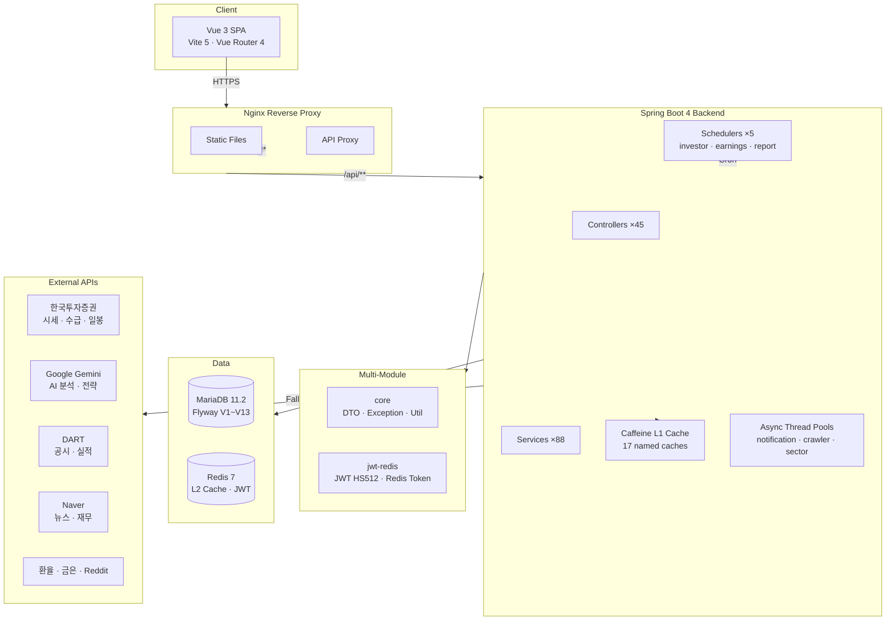

# My Platform — 실시간 주식 분석 & 생활 관리 플랫폼

> Spring Boot 4 + Vue 3 풀스택 멀티모듈 프로젝트
> 7종 외부 API 연동 · 2-Tier 캐시 · 점진적 로딩 · Docker Compose 배포


---

## Architecture



---

## 기술적 의사결정 (ADR)

### 1. 왜 2-Tier 캐시인가? (Caffeine L1 + Redis L2)

**문제:** 외부 API 7종(KIS, Gemini, DART 등)에 매 요청마다 호출하면 평균 20~30초 지연
**결정:** Caffeine(in-memory) L1 + Redis L2 2단계 캐시
**이유:**
- KIS 시세는 10~30초 TTL로 충분 (장중 실시간성과 API 부하의 균형)
- Gemini AI 분석은 15분 캐시 (비용 절감 + 응답 일관성)
- 단일 서버에서 Redis 없이도 Caffeine만으로 동작하도록 설계 (Redis는 optional)
- 캐시 히트율 90%+ 달성 시 API 호출 비용 1/10로 절감

### 2. 왜 점진적 로딩인가? (Quick → Heavy)

**문제:** 종목상세 페이지가 한 번에 모든 데이터를 로드하면 10~30초 대기
**결정:** 2단계 분리 — Quick API(시세+차트, 2~3초) → Heavy API(AI+리스크, 백그라운드)
**이유:**
- 사용자 체감 속도 10초+ → 2~3초로 개선
- `@Cacheable` self-invocation 문제 → 별도 `CacheService` 빈으로 분리하여 프록시 정상 동작
- 4개 외부 호출을 `CompletableFuture`로 완전 병렬화

### 3. 왜 KIS → Naver → DB 폴백 체인인가?

**문제:** 단일 데이터 소스 장애 시 전체 서비스 중단
**결정:** 3단계 폴백 — KIS API(정확도 최고) → Naver 크롤링(가용성 최고) → DB 캐시(최종 보루)
**이유:**
- KIS는 장 마감/점검 시간에 간헐적 실패
- 각 소스별 타임아웃 독립 설정 (KIS 15초, Naver 10초)
- 테스트 코드로 폴백 정상 동작 검증

---

## 주요 기능

### 투자 분석 (핵심)

| 기능 | 설명 |
|---|---|
| **V2 대시보드** | AI전략 TOP5 · 시장 히트맵 · 스마트머니(외인/기관) · 리서치 스크리너 |
| **종목 상세** | 점진적 로딩 (Quick→Heavy), 듀얼 점수 (단기 트레이딩 + 중장기 펀더멘털) |
| **AI 매매 전략** | Gemini 기반 분석 → 규칙기반 폴백, 목표주가 컨센서스 |
| **멀티 컨빅션** | 매수/매도/충돌 시그널, 수급-가격 괴리 감지 |
| **실적 공시** | DART 연동, 캘린더 뷰, AI 요약 |
| **글로벌 선물** | VIX · 미국채10Y · CNN Fear&Greed · 나스닥/S&P |
| **백테스트** | AI전략 vs 실전봇 적중률/수익률/MDD 비교 |

### 생활 관리

| 기능 | 설명 |
|---|---|
| **식단 관리** | 아침/점심/저녁/간식, 탄단지 영양소, 일일 칼로리 요약 |
| **운동 관리** | 유산소/근력/유연성/스포츠, 세트·횟수·무게, 소모칼로리 |
| **가계부** | 수입/지출 관리, 월별 통계, 고정지출, 파이차트 |
| **자산 관리** | 금/은/주식 보유현황, 손익 추적 |
| **파일 관리** | 폴더 구조, 드래그앤드롭 업로드, 이미지 미리보기 |
| **자동차 정비** | 정비 유형별 기록, 다음 정비 알림 |

### 시스템

| 기능 | 설명 |
|---|---|
| **인증** | JWT(HS512) + Redis 토큰 관리, 계정 잠금(10회 실패) |
| **알림** | Telegram 3채널(브리핑/시그널/리스크) + Gmail SMTP + SSE |
| **배치** | 투자자매매 수집 · 실적공시 · 일일리포트 · 알림 (5개 스케줄러) |
| **관리자** | 사용자 승인/잠금, CPU/메모리 모니터링, 배치 잡 관리 |

---

## 기술 스택

| Layer | Technology |
|---|---|
| **Backend** | Spring Boot 4.0 · Java 17 · Spring Security · JPA · Flyway |
| **Frontend** | Vue 3.4 (Composition API) · Vite 5 · Vue Router 4 · Axios |
| **Database** | MariaDB 11.2 · HikariCP (max 15) · Flyway V1~V13 |
| **Cache** | Caffeine L1 (17 caches) · Redis 7 L2 (optional) |
| **External API** | KIS · Gemini AI · DART · Naver · 환율 · GoldAPI · Reddit |
| **Infra** | Docker Compose · Nginx · GitHub Actions CI/CD |
| **Test** | JUnit 5 · Mockito · JaCoCo |

---

## 프로젝트 구조

```
my-platform/
├── backend/                    # Spring Boot 메인 서버
│   ├── controller/ (45)        #   REST API 컨트롤러
│   ├── service/ (88)           #   비즈니스 로직
│   ├── entity/ (38)            #   JPA 엔티티
│   ├── repository/ (37)        #   데이터 접근
│   ├── dto/                    #   데이터 전송 객체
│   ├── config/                 #   Security, Cache, Async, WebMvc
│   └── scheduler/              #   배치 잡 5종
├── frontend/                   # Vue 3 SPA
│   ├── views/ (20+)            #   페이지 컴포넌트
│   ├── components/v2/ (12)     #   대시보드 섹션 컴포넌트
│   └── utils/api.js            #   API 클라이언트 (JWT 인터셉터)
├── core/                       # 공통 모듈 (ApiResponse, Exception, Util)
├── jwt-redis/                  # JWT 발급/검증 + Redis 토큰
├── nginx/                      # 리버스 프록시 설정
├── docker-compose.yml          # MariaDB + Redis + Backend + Nginx
├── Dockerfile                  # Java 17 Alpine + Health Check
└── .github/workflows/          # CI/CD (build → Docker → deploy)
```

---

## 테스트

```bash
./gradlew :backend:test        # 30 tests, JaCoCo 리포트 생성
```

| 테스트 클래스 | 검증 포인트 |
|---|---|
| `StockDetailServiceTest` | KIS 폴백 체인, Quick/Heavy 분리, 병렬 실패 허용 |
| `RiskManagementServiceTest` | 위험 공시 DANGER 판정, 뉴스 폴백, 전체 API 실패 시 SAFE |
| `GeminiServiceTest` | API 키 검증, Rate Limit 재시도, 네트워크 에러 복구 |
| `StockDetailControllerTest` | summary/quick/heavy 응답 스펙, 500 에러 처리 |
| `AuthControllerTest` | 로그인 JWT 반환, 회원가입 검증 |

---

## 배포

```
GitHub Actions (main/develop push)
    ├── build-frontend (Node 20)
    ├── build-backend (JDK 17, bootJar)
    └── build-python (Docker)
         ↓
Docker Compose (5 services):
    ┌─ Nginx 1.25 (리버스 프록시, 정적 파일)
    ├─ Backend (Java 17 Alpine, 1536MB)
    ├─ Python Backend (AI 보조, 512MB)
    ├─ MariaDB 11.2
    └─ Redis 7
```

---

## 빠른 시작

```bash
# 1. 클론
git clone https://github.com/pusam/my-platform.git
cd my-platform

# 2. 프론트엔드 의존성
cd frontend && npm install && cd ..

# 3. 백엔드 실행 (local 프로파일)
./gradlew :backend:bootRun --args='--spring.profiles.active=local'

# 4. 프론트엔드 개발 서버
cd frontend && npm run dev
```

| 서비스 | URL |
|---|---|
| 프론트엔드 (개발) | http://localhost:5173 |
| 백엔드 API | http://localhost:8080 |
| Swagger UI | http://localhost:8080/swagger-ui.html |

> 환경 변수 설정은 `backend/src/main/resources/application-local.yml` 참조

---

## License

Private project for portfolio demonstration.
